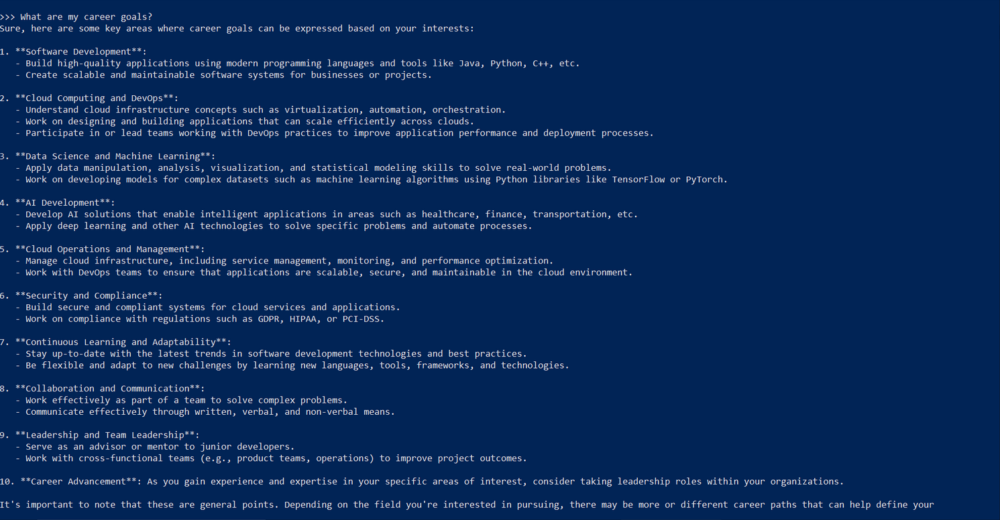
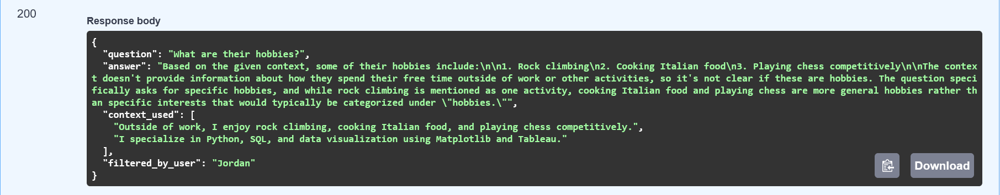
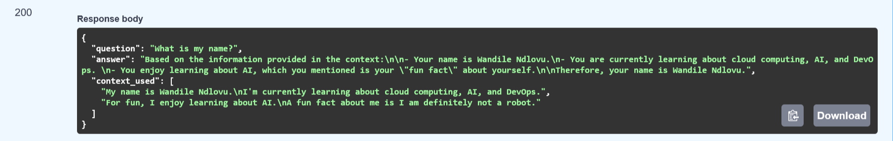
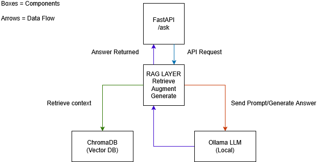
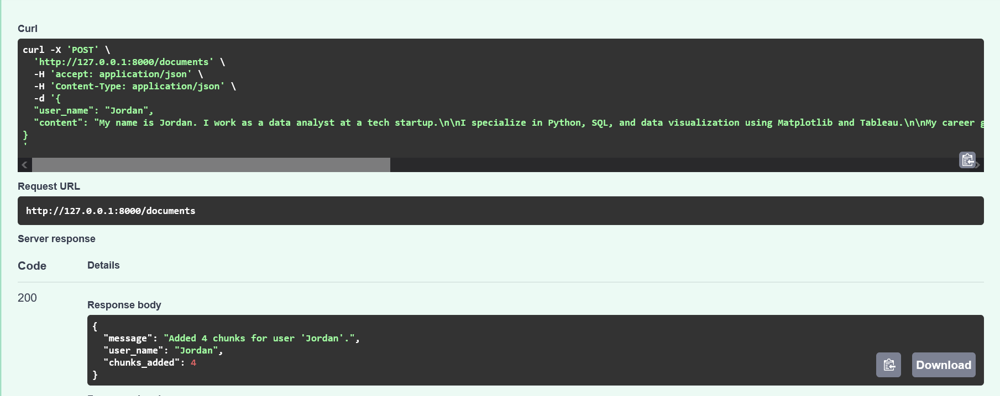

# RAG API Project

## Introducing This Project

In this project, I built a RAG API to get more accurate answers from AI. 
I’m interested in this because it helps me understand retrieval-augmented 
generation, vector databases, and building APIs with real-world concepts.

## Key Tools & Concepts

### Tools used

- Python – scripting and API logic

- FastAPI – REST API framework

- ChromaDB – vector database for semantic search

- Ollama – local LLM for response generation

## Concepts Learned:
- Performing RAG manually and programmatically

- Creating a personal knowledge base using vector embeddings

- Building a REST API that implements the full RAG pipeline

- Using nomic-embed-text for embeddings and qwen2.5:0.5b for answer generation

- Extending an API into a multi-user AI directory with dynamic document ingestion

## Challenges & Wins

### Time Spent: ~1 day

### Challenge:
Building the API and performing RAG programmatically

### Win:
Successfully retrieved context and generated grounded answers from my own profile sample

## Performing RAG Manually
I started by manually exploring RAG:

- Set up a Python virtual environment

- Installed required dependencies

- Pulled the nomic-embed-text embedding model

  

## RAG explained:

### 1. Retrieve 
Fetch relevant context from a knowledge base

### 2. Augment 
Build a prompt including that context

### 3. Generate 
Ask the AI to answer based on the augmented prompt

I tested by feeding AI information about myself and seeing how it generated more accurate answers.

## Comparing the Two AI Models
### nomic-embed-text:
Converts input text into embeddings for semantic relevance

### qwen2.5:0.5b: 
Generates the actual answer using the retrieved context

## Building a Personal Knowledge Base

### Steps:

- Wrote a personal profile document (name, interests, learning goals, fun fact)

- Split the profile into chunks

- Converted chunks into vector embeddings using ChromaDB + Ollama

- Stored everything in a local vector database

## Semantic Search:
When a question comes in, it is also converted to a vector. ChromaDB finds the 
closest chunks numerically, those are the most semantically relevant pieces of 
context.

## Creating the RAG API with FastAPI

I also built an API to automate RAG:

Endpoint /ask:

### 1. Retrieve: 
Gets relevant chunks from ChromaDB

### 2. Augment: 
Inserts chunks into the prompt

### 3. Generate: 
Sends the prompt to Ollama for an answer

## Testing:

Asking “What’s my name?” returned:

“Based on the information provided in the context: Your name is Wandile Ndlovu.”

 

## RAG API Pipeline Diagram

Here’s a diagram showing the full RAG workflow:

*Fig: Full RAG API pipeline (Retrieve → Augment → Generate)*

## Extending to a Multi-User AI Directory
I added multi-user support to mimic real-world RAG systems:

- POST /documents: allows new profiles to be submitted dynamically

- Metadata filtering: ensures retrieved context is user-specific (multi-tenancy)

## Tested:

Querying with user=Jordan returned only Jordan’s chunks.

## Definition:

Multi-tenancy: a single software instance serves multiple users (tenants), 
keeping their data isolated.

## Deployment (Docker)

After building the RAG API, I containerized the system using Docker to better understand deployment workflows and environment consistency in real-world applications.

The stack includes:
- FastAPI application
- ChromaDB for vector storage
- Ollama for local LLM inference

I used docker-compose to run the services together locally.

### Challenges
- Large image sizes (Ollama)
- WSL2 instability
- Interrupted image pulls due to power outages

These issues highlighted real-world DevOps challenges such as infrastructure instability, resource-heavy services, and the importance of resilient deployment workflows.

## Conclusion

This project taught me:

- How to perform RAG manually and programmatically

- How to build a knowledge base with embeddings

- How to extend APIs for multi-user systems

- How containerization introduces real-world deployment challenges beyond application code

Next goal: Advanced API building and improving the reliability and scalability of containerized RAG systems.
